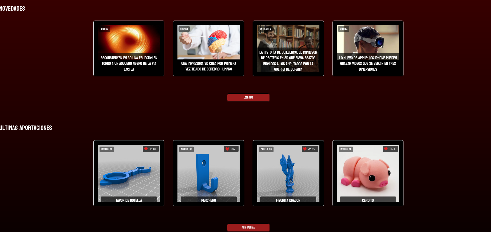
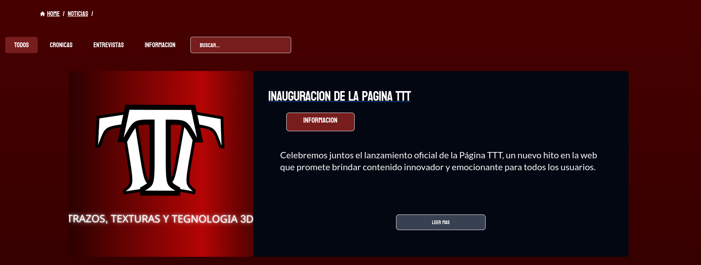
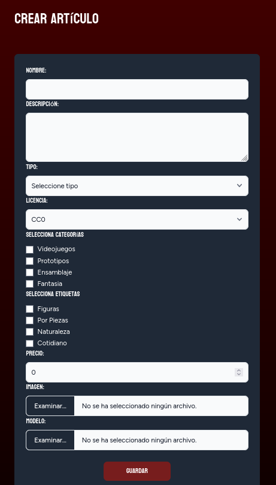

<div align="center">

</div>

# <div align="center" style="color:red;">Trazos, Texturas y Tecnología 3D</div>
## <div align="center">Curso 2023/24 IES Doñana</div>
### <div align="center">Salvador Jimenez Fernandez</div>

## 1. Descripción General del Proyecto

**TTT** permitirá a los usuarios subir, compartir y ver modelos y texturas en formato 3D. La aplicación tiene una galería de modelos 3D y funcionalidades de comunidad.

La galería proporciona un espacio donde los usuarios pueden explorar, calificar y comentar sobre modelos y texturas en 3D subidos por otros usuarios.

## 2. Funcionalidad Principal de la Aplicación

La funcionalidad principal de la aplicación es servir como una galería y un mercado para modelos y texturas en 3D. Los usuarios pueden explorar el contenido subido por otros usuarios, comentar y calificar los modelos.

Además, la aplicación incluirá un sistema de mercado donde los usuarios podrán poner a la venta sus modelos a cambio de un precio. Es necesario registrarse o iniciar sesión.

Los administradores tendrán un panel exclusivo donde podrán trabajar con la base de datos (borrar comentarios, bloquear usuarios, crear noticias, crear nuevas etiquetas o categorías).

## 3. Objetivos Generales

- **Objetivo:** Visualización de contenido 3D, comercio entre usuarios y sistema de comentarios entre usuarios.
- **Casos de Uso:**
  - **Invitado (usuario no registrado):**
    - Registrarse.
  - **Usuario registrado:**
    - Iniciar sesión.
    - Editar su perfil.
    - Ver un perfil.
    - Buscar y ver artículos y texturas en 3D.
    - Comentar en un artículo.
    - Subir un artículo o textura en 3D.
    - Poner a la venta sus artículos a cambio de un precio.
    - Comprar artículos a otros usuarios.
    - Pago a través de monedero o API de Paypal.
    - Descargar un artículo comprado.
    - Descargar un albarán de la compra.
  - **Administrador:**
    - Crear, modificar y borrar artículos y noticias.
    - Crear, modificar y borrar etiquetas y categorías.
    - Bloquear usuarios.
    - Borrar usuarios.
    - Borrar comentarios de usuarios.
    - Borrar albaranes.

## 4. Elementos de Innovación

- Uso de framework Laravel 11 con Inertia React.
- Uso de librerías de React (axios).
- Uso de librerías de JS (Babylon.ts).
- Uso de Tailwind CSS.
- Uso de APIs (Paypal).

## 5. Vistas de la Aplicación

### Vista "Welcome"

<div align="center">

</div>

Esta es la vista que ve un usuario al entrar en la aplicación por primera vez, donde deberá loguearse o registrarse si no tiene cuenta.

### Vista "Dashboard"

<div align="center">

</div>

Esta es la vista que verá un usuario al loguearse en la aplicación, donde se cargará el layout de autenticado y el usuario tendrá acceso a todos los recursos disponibles.

### Elemento "Navegador"

<div align="center">

</div>

El navegador está presente en toda la aplicación siempre que el usuario esté logueado. Desde aquí puede dirigirse a las partes principales de la aplicación. Siempre hay migas de pan para guiar al usuario en qué lugar de la página se encuentra.

### Elemento "Footer"

<div align="center">

</div>

Al igual que el navegador, este se encuentra en toda la página del usuario logueado. Desde este se puede acceder a los derechos reservados, enlaces de redes sociales y información de cuántos usuarios y artículos hay en la aplicación.

### Vista "Noticias"

<div align="center">

</div>

Esta vista permite al usuario consultar las noticias de la página. Posee una serie de filtros para facilitar las búsquedas y un buscador para los casos más específicos.

### Vista "Noticia Show"

<div align="center">

</div>

Esta es la vista de una noticia si accedemos a ella. Aquí podemos ver toda la información disponible.

### Vista "Artículos"

<div align="center">

</div>

Esta vista permite al usuario consultar los artículos de la página. Posee una serie de filtros para facilitar las búsquedas y un buscador para los casos más específicos. El usuario también tiene la opción de darle "like" al artículo desde aquí.

### Vista "Artículo Show"

<div align="center">

</div>

Esta es la vista de un artículo si accedemos a él. Aquí podemos ver toda la información disponible. El usuario puede ver el artículo renderizado a través de JS por medio de Babylon.ts e interactuar en vivo con el modelo. El usuario puede pagar el artículo ya sea por medio de un sistema de monedero de la página o desde la API de Paypal. Tras realizar la compra se le redirigirá a la vista de factura. Los usuarios también pueden comentar el artículo y, si es el dueño de este o el administrador, puede borrarlo aquí.

### Vista "API de Paypal"

<div align="center">

</div>

Esta es la vista donde se llama a la API de Paypal.

### Vista "Albarán"

<div align="center">

</div>

Esta es la vista donde se ven los datos de la compra del artículo por parte del usuario. Esta vista ofrece las funciones de descargar el artículo y descargar el albarán en PDF.

### Vista "PDF"

<div align="center">

</div>

Este es un ejemplo del PDF generado por la aplicación.

### Vista "Nosotros"

<div align="center">

</div>

Esta vista detalla un poco la información de nuestra empresa ficticia por si al usuario le interesa saber más de esta.

### Vista "Derechos"

<div align="center">

</div>

Esta vista informa de los derechos legales que posee la página.

### Vista "Perfil"

<div align="center">

</div>

Esta vista muestra nuestra información personal, qué artículos nos pertenecen y qué funciones podemos hacer (Editar y Borrar). También muestra nuestras compras en la aplicación, nuestras últimas visitas (las cuales funcionan por cookies), la opción de rellenar nuestro monedero a través de la API de Paypal, y la opción de llamar a la vista de editar perfil para cambiar nuestra información.

### Vista "Perfil Editar"

<div align="center">

</div>

En esta vista podremos editar nuestra cuenta, desde cambiar nuestra imagen de perfil, añadir información extra como una descripción sobre nosotros o nuestra fecha de nacimiento, hasta cambiar nuestras credenciales como el email.

### Vista "Perfil Otro"

<div align="center">

</div>

Esta vista muestra la información personal y artículos de otros usuarios de la aplicación.

### Vista "Admin"

<div align="center">

</div>

Esta vista solo tendrá acceso a ella los que estén marcados como admin en la aplicación. Desde aquí el admin puede trabajar directamente con la base de datos sin saber cómo funciona esta. Aquí es donde se puede acceder al "create" de las noticias, pues solo un administrador puede hacerlas.

### Vista "Admin Bases de Datos"

<div align="center">

</div>

Esta vista muestra los elementos de la base de datos en base a lo que elija el admin. Desde aquí puede realizar las funciones de Editar o Borrar de los elementos. En el caso de Usuarios solo se puede Bloquear o Borrar al usuario. Un Usuario Bloqueado no puede acceder a la aplicación.

### Vista "Bloqueado"

<div align="center">

</div>

Esta vista es donde será redirigido un usuario a través de un Middleware si este está bloqueado, impidiendo que entre en la aplicación.

### Vista "Formulario"

<div align="center">

</div>

Los formularios de la aplicación tienen este aspecto visual. Todas las validaciones se realizan en conjunto de Laravel, Inertia y React.

## Configuración del Entorno

### Requisitos Previos

Asegúrate de tener instalados PHP, Composer, Vite y PostgreSQL en tu sistema. Aquí tienes los comandos para instalarlos en un sistema basado en Debian como Ubuntu:

#### Instalar PHP y extensiones necesarias

```bash
sudo apt install php8.3 php8.3-amqp php8.3-cgi php8.3-cli php8.3-common php8.3-curl php8.3-fpm php8.3-gd php8.3-igbinary php8.3-intl php8.3-mbstring php8.3-opcache php8.3-pgsql php8.3-readline php8.3-redis php8.3-sqlite3 php8.3-xml php8.3-zip php8.3-bcmath php8.3-gmp php-imagick
```

Despendiendo del momento de la instalacion quizas debas usar una version mas nueva de PHP, en el caso de ello Linux/Ubuntu te avisaran.

# Instalar Composer

```bash
sudo apt install composer
```

# Instalar PostgreSQL

```bash
sudo apt install postgresql postgresql-client postgresql-contrib
```

# Instalar Vite

```bash
    npm install
```

Antes de ejecutar las migraciones, asegúrate de tener configurada la base de datos PostgreSQL creando un nuevo usuario y una base de datos.

Ejecuta el siguiente comando para crear un nuevo usuario (serás solicitado a ingresar una contraseña para el nuevo usuario):

```bash
sudo -u postgres createuser -P **nombreUsusario**
```

Crea una nueva base de datos asignada a este usuario ejecutando:

```bash
sudo -u postgres createdb -O **nombreUsusario nombreDB**
```

La contraseña que asignaremos será: **1234werty**

En el archivo .env  hay que modificar las bases de datos.

```bash
DB_CONNECTION=pgsql
DB_HOST=127.0.0.1
DB_PORT=5432
DB_DATABASE=ttt
DB_USERNAME=ttt
DB_PASSWORD=1234werty
```

Tambien debemos añadir las dependencias para el envio de correos de verificacion y la cuenta de desarrollo de Paypal

Para el Correo

```bash
MAIL_MAILER=smtp
MAIL_HOST=smtp.gmail.com
MAIL_PORT=587
MAIL_USERNAME=tu_correo
MAIL_PASSWORD="la key de aplicacion de tu correo"
MAIL_ENCRYPTION=tls
MAIL_FROM_ADDRESS=tu_correo
MAIL_FROM_NAME="${APP_NAME}"
```

Para Paypal

```bash
#PayPal API Mode
# Values: sandbox or live (Default: live)
PAYPAL_MODE=sanbox

#PayPal Setting & API Credentials - sandbox
PAYPAL_SANDBOX_CLIENT_ID=ID del Sandbox Paypal Developer
PAYPAL_SANDBOX_CLIENT_SECRET=key del Sandbox Paypal Developer
PAYPAL_MODE=sandbox

#PayPal Setting & API Credentials - live
PAYPAL_LIVE_CLIENT_ID=" no es necesario para el proyecto "
PAYPAL_LIVE_CLIENT_SECRET=" no es necesario para el proyecto "
```

## Configuración del Proyecto

Clona el repositorio y navega al directorio del proyecto. Instala las dependencias de PHP con Composer.

```bash
 composer install
```

Con todos los pasos anterirores realizados,ya puedes hacer las migraciones.

```bash
 php artisan migrate:fresh --seed
```

En las migraciones se incluye un perfil de Admin.

```bash
 cuenta admin@admin.es
 contraseña 1234werty
```

En caso de querer añadir mas administradores tiene que ser mediante inserciones a la base de datos.

En caso que se quiera entrar con un usuario normal puedes usar este.

```bash
 cuenta salva@salva.es
 contraseña 1234werty
```

# Ejecución de la Aplicación

1. Ejecutar `npm run dev` para iniciar el Node.js y sus dependencias.
2. Ejecutar `php artisan serve` para iniciar el servidor.
3. Acceder a la url que te proporciona el comando anterior para que se ejecute en local.
