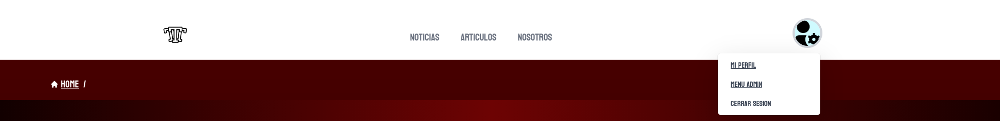

<p align="center">

</p>

<h1 align="center" style="color:red" >
Trazos, Texturas y Tecnología 3D
</h1>
<h1 align="center">
Curso 2023/24 IES Doñana
</h1>

<h1 align="center">
Salvador Jimenez Fernandez
</h1>

## 1. Descripción General del Proyecto

TTT permitirá a los usuarios subir, compartir y ver modelos y texturas en formato 3D.

La aplicación tiene una galería de modelos 3D y una funcionalidades de comunidad.

La galería proporciona un espacio donde los usuarios pueden explorar, calificar y comentar sobre modelos y texturas en 3D subidos por otros usuarios.

## 2. Funcionalidad Principal de la Aplicación

La funcionalidad principal de la aplicación es servir como una galería y un mercado para modelos y texturas en 3D. Los usuarios pueden explorar el contenido subido por otros usuarios, comentar y calificar los modelos.

Además, la aplicación incluirá un sistema de mercado donde los usuarios podrán poner a la venta sus modelos a cambio de un precio.  

Es necesario registrarse o iniciar sesión.

Los administradores tendrán un panel exclusivo donde podrán trabajar con la base de datos.
(borrar comentarios, bloquear usuarios, crear noticias, crear nuevas etiquetas o categorias).

## 3. Objetivos Generales

- **Objetivo:** Visualización de contenido 3D, comercio entre usuarios y sistema de comentarios entre usuarios.
- **Casos de Uso:**
  - **Invitado (usuario no logueado):**
    - Registrarse.
  - **Usuario:**
    - Iniciar sesión.
    - Editar su perfil.
    - Ver un perfil.
    - Buscar y ver articulos y texturas en 3D.
    - Comentar en un articulo.
    - Subir un articulo o textura en 3D.
    - Poner a la venta sus articulos a cambio de un precio.
    - Comprar articulos a otros usuarios.
    - Pago a traves de monedero o API de Paypal
    - Desgargar un articulo comprado.
    - Descargar un Albaran de la compra.
  - **Administrador:**
    - Crear, modificar y borrar articulos y noticias.
    - Crear, modificar y borrar etiquetas y categorias.
    - Bloquear usuarios.
    - Borrar usuarios.
    - Borrar comentarios de usuarios.
    - Borrar albaranes.

## 4. Elementos de Innovación

- Uso de framework Laravel 11 con Inertia React.
- Uso de librerias de React (axios).
- Uso de librerias de JS (Babylon.ts).
- Uso de Tailwind CSS.
- Uso de APIs (Paypal).

## Vistas aplicación

- Vista "Welcome"

<p align="center">

</p>

Esta es la vista que ve un Usuario al entrar en la aplicacion por primera vez, donde debera logearse o registrarse si no tiene cuenta.

- Vista "Dashboard"

<p align="center">

</p>

Esta es la vista que vera un Usuario al logearse en la aplicacion, aqui se cargara el layout de autenticated y el usuario tendra acceso a todos los recursos disponibles.

Aqui mostramos los ultimos elementos intersantes de la aplicacion como ultimas noticias o los articulos en tendencia actualmente.


- Elemento "Navegador"

<p align="center">

</p>

El navegador esta presente en toda la aplicacion, simepre que el usuario este logeado, desde aqui puede dirigirse a las parte principales de la aplicacion.

Siempre hay una migas de pan para guiar al usuario en que lugar de la pagina se encuentra.

- Elemento "Footer"

<p align="center">

</p>

Al igual que el navegador este se encuentra en toda la pagina del usuario logeado, desde este se puede acceder a los derechos reservados, link de redes sociales y informacion de cuantos usuarios y articulos hay en la aplicacion.

- Vista "Noticias"

<p align="center">

</p>

Esta esta es la vista donde el usuario podra consultar las noticias de la pagina, posee una serie de filtros para facilitar las busquedas y un buscador para los casos mas especificos

- Vista "Noticia Show"

<p align="center">


Esta es la vista de una noticia si accedemos a ella, aqui podemos ver toda la informacion disponible que tiene.

- Vista "Articulos"

<p align="center">

</p>

Esta esta es la vista donde el usuario podra consultar los articulos de la pagina, posee una serie de filtros para facilitar las busquedas y un buscador para los casos mas especificos.
Tambien el usuario tiene la opcion de darle like al articulo desde aqui.

- Vista "Articulo Show"

<p align="center">


Esta es la vista de un articulo si accedemos a el, aqui podemos ver toda la informacion disponible que tiene.
El usuario puede ver el articulo renderizado a traves de JS por medio de Babylon.ts y interactuar en vivo con el modelo.
El usuario puede pagar el articulo ya sea por medio de un sistema de monedero de la pagina o desde la API de paypal.
Tras realizar la compra se le reedirigira a la vista factura.
Los usuarios tambien pueden comentar el articulo y si es el dueño deste o el administrador puede borrarlo aqui.

- Vista  "API de Paypal"

<p align="center">


Esta es la vista donde se llama a la API de Paypal.

- Vista  "Albaran"

<p align="center">


Esta es la vista donde se ve los datos de la compra del articulo por parte del usuario.
Esta vista ofrece las funciones de descargar el articulo y descargar el albaran en PDF

- Vista  "PDF"

<p align="center">


Este es un ejemplo del pdf generado por la aplicacion.

- Vista  "Nosotros"

<p align="center">


Esta vista detalla un poco la informacion de nuestra empresa ficticia por si al usuario le interesa saber mas de esta.

- Vista  "Derechos"

<p align="center">


Esta vista informa de los derechos legales que posee la pagina.

- Vista  "Perfil"

<p align="center">


Esta vista muestra nuestra informacion personal, que articulos nos pertenecen y que funciones podemos hacer (Editar y Borrar).
Nuestras Compras en la aplicacion.
Nuestras ultimas visitas, las cuales funcionan por cookies.
La opcion de rellenar nuestro monedero a traves de la API de Paypal.
La opcion de llamar a la vista de editar perfil para cambiar nuestra informacion.

- Vista  "Perfil Editar"

<p align="center">


Esta vista podremos editar nuestra cuenta, desde cambiar nuestra imagen de perfil, añadir informacion extra como una descripcion sobre nosotros o nuestro cumpleaños.
Hasta cambiar nuestra credenciales como el email.

- Vista  "Perfil Otro"

<p align="center">


Esta vista muestra la informacion personal y articulos de otros usuarios de la aplicacion.

- Vista  "Admin"

<p align="center">


Esta vista solo tendra acceso a ella los que esten marcados como admin en la aplicacion.

Desde aqui el admin puede trabajar directamente con la base de datos sin saber como funciona esta.

Aqui es donde se puede acceder al create de las noticias, pues solo un administrador puede hacerlas.

- Vista  "Admin Bases de Datos"

<p align="center">


Esta vista muestra los elementos de la base de datos en base a que elija el admin.
Desde aqui puede realizar las funciones de Editar o Borrar de los elementos.
En el caso de Usuarios solo se puede Bloquear o Borrar al usuario.
Un Usuario Bloqeuado no puede acceder a la aplicacion.

- Vista  "Bloqueado"

<p align="center">


Esta vista es donde sera reedirigido un usuario a traves de un Middleware si este esta bloqueado, impidiendo que entre en la aplicacion.

- Vista  "Formulario"

<p align="center">


Los formularios de la aplicacion tienen este aspecto visual, toda las validaciones se realizan en conjunto de Laravel - Inertia - React

## Configuración del Entorno

### Requisitos Previos

Asegúrate de tener instalados PHP, Composer, Vite y PostgreSQL en tu sistema. Aquí tienes los comandos para instalarlos en un sistema basado en Debian como Ubuntu:

# Instalar PHP y extensiones necesarias

```bash
sudo apt install php8.3 php8.3-amqp php8.3-cgi php8.3-cli php8.3-common php8.3-curl php8.3-fpm php8.3-gd php8.3-igbinary php8.3-intl php8.3-mbstring php8.3-opcache php8.3-pgsql php8.3-readline php8.3-redis php8.3-sqlite3 php8.3-xml php8.3-zip php8.3-bcmath php8.3-gmp php-imagick
```

Despendiendo del momento de la instalacion quizas debas usar una version mas nueva de PHP, en el caso de ello Linux/Ubuntu te avisaran.

# Instalar Composer

```bash
sudo apt install composer
```

# Instalar PostgreSQL

```bash
sudo apt install postgresql postgresql-client postgresql-contrib
```

# Instalar Vite

```bash
    npm install
```

Antes de ejecutar las migraciones, asegúrate de tener configurada la base de datos PostgreSQL creando un nuevo usuario y una base de datos.

Ejecuta el siguiente comando para crear un nuevo usuario (serás solicitado a ingresar una contraseña para el nuevo usuario):

```bash
sudo -u postgres createuser -P **nombreUsusario**
```

Crea una nueva base de datos asignada a este usuario ejecutando:

```bash
sudo -u postgres createdb -O **nombreUsusario nombreDB**
```

La contraseña que asignaremos será: **1234werty**

En el archivo .env  hay que modificar las bases de datos.

```bash
DB_CONNECTION=pgsql
DB_HOST=127.0.0.1
DB_PORT=5432
DB_DATABASE=ttt
DB_USERNAME=ttt
DB_PASSWORD=1234werty
```

Tambien debemos añadir las dependencias para el envio de correos de verificacion y la cuenta de desarrollo de Paypal

Para el Correo

```bash
MAIL_MAILER=smtp
MAIL_HOST=smtp.gmail.com
MAIL_PORT=587
MAIL_USERNAME=tu_correo
MAIL_PASSWORD="la key de aplicacion de tu correo"
MAIL_ENCRYPTION=tls
MAIL_FROM_ADDRESS=tu_correo
MAIL_FROM_NAME="${APP_NAME}"
```

Para Paypal

```bash
#PayPal API Mode
# Values: sandbox or live (Default: live)
PAYPAL_MODE=sanbox

#PayPal Setting & API Credentials - sandbox
PAYPAL_SANDBOX_CLIENT_ID=ID del Sandbox Paypal Developer
PAYPAL_SANDBOX_CLIENT_SECRET=key del Sandbox Paypal Developer
PAYPAL_MODE=sandbox

#PayPal Setting & API Credentials - live
PAYPAL_LIVE_CLIENT_ID=" no es necesario para el proyecto "
PAYPAL_LIVE_CLIENT_SECRET=" no es necesario para el proyecto "
```

## Configuración del Proyecto

Clona el repositorio y navega al directorio del proyecto. Instala las dependencias de PHP con Composer.

```bash
 composer install
```

Con todos los pasos anterirores realizados,ya puedes hacer las migraciones.

```bash
 php artisan migrate:fresh --seed
```

En las migraciones se incluye un perfil de Admin.

```bash
 cuenta admin@admin.es
 contraseña 1234werty
```

En caso de querer añadir mas administradores tiene que ser mediante inserciones a la base de datos.


En caso que se quiera entrar con un usuario normal puedes usar este.

```bash
 cuenta salva@salva.es
 contraseña 1234werty
```

# Ejecución de la Aplicación

1. Ejecutar `npm run dev` para iniciar el Node.js y sus dependencias.
2. Ejecutar `php artisan serve` para iniciar el servidor.
3. Acceder a la url que te proporciona el comando anterior para que se ejecute en local.
